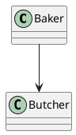
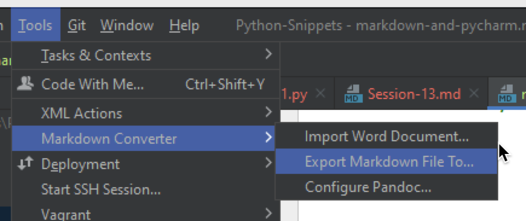

# Markdown and PyCharm

- [ ] TODO: Introductory text

## Create a Markdown Document

1) File --> New --> File
2) Type in filename, eg `Diagram-01.md`
   Must have `.md` for PyCharm et al to recognise the file as a Markdown document

## Basics

# Heading 1

## Heading 2

### Heading 3

#### Heading 4

##### Heading 5

###### Heading 6

### Lists

Unordered (Bulleted List):

- List item 1
- List item 2
- List item 3

* List Item 1
* List Item 2
* List Item 3

Ordered (Numbered List)

1. Test 1
2. Test 4
3. Test 3
4. Roman numbers
    1. Roman 2 sub list
        1. Sub Sub list
    2. Roman 2
    3. Roman 2
5. End of List

### Horizontal Rule

Three dashes (blank line before and after)

--- 

#### Bold:

- **Bold Text** `**Bold**`
- __Bold__      `__Bold__`

#### Italics:

- *Italic*   `*Italic*`
- _Italic_  `_Italic_`

#### Inline Code:

Surround code in single back-tick: `counter = 1`.

#### Block of code:

Surround by triple back-ticks, plus add language after first three.

```python
given_name = input("What is your first name: ")
family_name = input("What is your last name: ")
print(f"nice to meet you {given_name} {family_name}")
```



```php
function main(){
   int count = 0;
   count = count + 2;
   sprintf(count);
}
```

### Keyboard sequences:

- <kbd>CTRL</kbd>+<kbd>ALT</kbd>+<kbd>S</kbd> PyCharm Settings
- <kbd>CTRL</kbd>+<kbd>ALT</kbd>+<kbd>L</kbd> Reformat code

## Text

Type in paragraph. No blank line means next text
is part of the same paragraph.

Blank line to separate the text/paragraphs.

## Hyperlink

Link uses `[Link Text](URI/Web link)`, for example:
[Adrian's Diigo Account](https://diigo.com/profile/Ady_Gould) which
is `- [Adrian's Diigo Account](https://diigo.com/profile/Ady_Gould)`

Link to another MD doc in the same project: [UML Diagram 01](../uml_diagrams/diagram-01.md).

## Images

Add image using ``.



## Markdown Output as...

Tools --> Markdown Converter --> Select the putput format

- HTML
- PDF
