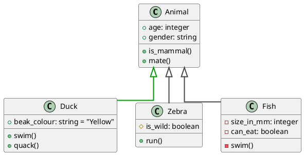

# Class Diagram

Diagram shown at: //www.plantuml.com/plantuml/png/LP11QiCm44NtEiMGRXA2Bn3Qaa3f7TgDc3Y38op9haR2qAPtRpMMXUsLzHWz_VbdZXXYSbQfYpSEBJm_cWRUKjjlm2TT0sx8k-6xKgr5PYZyHm4S0JiwWV6HEWe2El8t2YVW68pl11dM3fr3kp_8sM6a_z_V8fJtY-vAsEjsi4Eg2dY1tGTPEqmx6U79k2BwIjZsAvF455C3RBv96w-Tg_c4j-WrOJp1THWieHTOdDKZ1OZeAQUVZBsjBnmX93_FdydVSg7vg_KkQK8oiSJnwAYMai5soL9Tr7bkVzXWNl3QiGfx6KTByokZ6Ra6hSvCIsEy7E_8UZCjGb51qpnUv_2gBlW7
