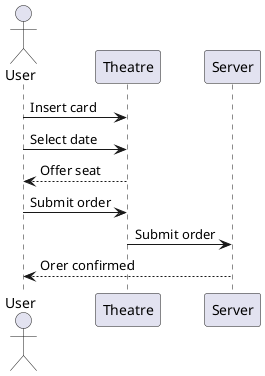
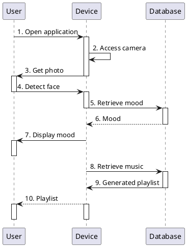
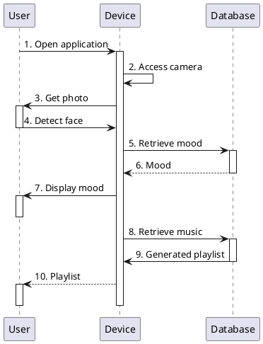

# Sequence Diagram


```plantuml
@startuml
actor User
participant Theatre
participant Server

User -> Theatre : Insert card
User -> Theatre : Select date
User <-- Theatre : Offer seat
User -> Theatre : Submit order
Theatre -> Server : Submit order
Server --> User : Orer confirmed

@enduml
```



```plantuml
@startuml
User -> Device : 1. Open application
activate Device
Device -> Device : 2. Access camera
Device -> User : 3. Get photo
deactivate Device
activate User
User -> Device : 4. Detect face
deactivate User
activate Device
Device -> Database : 5. Retrieve mood
deactivate Device
activate Database
Database --> Device : 6. Mood
deactivate Database
Device -> User : 7. Display mood
activate User
deactivate User
Device -> Database : 8. Retrieve music
activate Database
Database -> Device : 9. Generated playlist
deactivate Database
Device --> User : 10. Playlist 
activate Device
deactivate Device
activate User
deactivate User 

@enduml
```



```plantuml
@startuml
User -> Device : 1. Open application
activate Device
Device -> Device : 2. Access camera
Device -> User : 3. Get photo
activate User
User -> Device : 4. Detect face
deactivate User
Device -> Database : 5. Retrieve mood
activate Database
Database --> Device : 6. Mood
deactivate Database
Device -> User : 7. Display mood
activate User
deactivate User
Device -> Database : 8. Retrieve music
activate Database
Database -> Device : 9. Generated playlist
deactivate Database
Device --> User : 10. Playlist 
activate User
deactivate User 
deactivate Device
@enduml
```


```planmtuml
@startuml

@enduml
```
