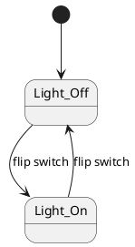
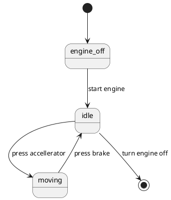

# State Diagram

```plantuml
@startuml

[*] --> Light_Off
Light_Off --> Light_On : flip switch

Light_On --> Light_Off : flip switch

@enduml
```

```plantuml
@startuml

[*] --> engine_off

engine_off --> idle : start engine

idle --> moving : press accellerator

moving --> idle : press brake

idle --> [*] : turn engine off

@enduml
```
